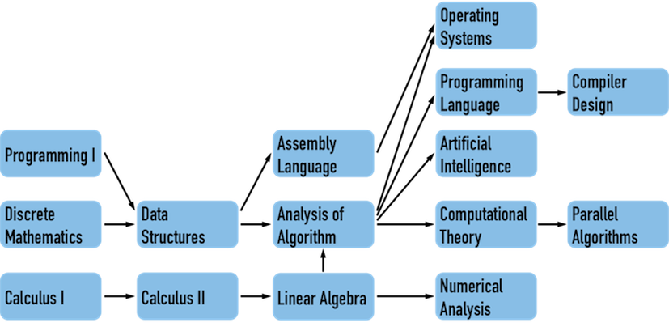
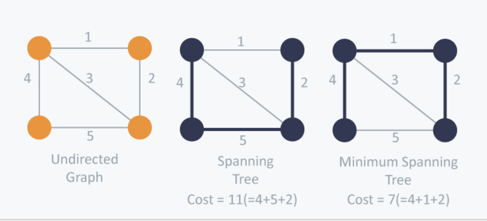
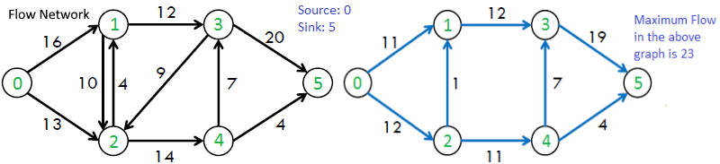

# Graph Algorithms


V: vertex
E: edge

## Search

Unlike trees, graphs may contain cycles, so we need a boolean visited graph (array). Time complexity is $ O(V+E) $.

1. DFS
2. BFS

Both can be implemented recursively or iteratively (DFS with stack, BFS with queue)

## Cycles Detection in Graph
Using colors. $O(V+E)$
White: Vertex is not yet visited..
Gray: Vertex is being processed by DFS.
Black: Vertex and all its descendants are processed

While doing DFS, if we encounter an edge from current vertex to a gray vertex, then this edge is a back edge and thus there exist cycle.

```Python
color = ['WHITE'] * V.count
def dfs(i):
	color[i] = 'GRAY'
	for v in graph[i]:
		if color[v] == 'GRAY':
			return True
		if color[v] =='WHITE' and dfs(v)==True:
			return True
	
	color[i] = 'BLACK'
	return False

for i in range(V.count):
	if color[i]=='WHITE':
		if dfs(i) == True:
			print('Cycle deteced')

print('No cycle')
```

## Topological Sorting

If there exist a directed edge $uv$ (vertex $u$ to vertex $v$), then vertex $u$ must comes before $v$ in topological order.

Only for DAG (directed acyclic graph). One DAG may have many topological sorting.



In topological sorting, Calculus I must comes before Calculus II. The order of Data Structures and Linear Algebra doesn't matter.

Use DFS + stack to find a topological sorting. $O(V+E)$
```Python
stack = []
visited = [False] * V.count
def dfs(v):
	visited[v] = True
	for i in graph[v]:
		if not visited[i]: dfs(i)
	stack.append(v)

for i in range(V.count):
	if not visited[i]: dfs(i)

print(stack[::-1]) # pop each element and print
```

## Minimum Spanning Tree (MST)


Can be solved using Prim's algorithm (greedy). $O(V^2)$
1. Start at one vertex.
2. Repeatedly choose the minimum cost edge to add new vertex into MST.
3. Stop when MST includes all vertices.

## Shortest path
Find the shortest cost path from source to all vertices in the graph. 

### Dijkstra's Algorithm

A greedy algorithm like Prim's MST, we generate s shortest path tree (SPT) with given source as root. $O(V^2)$ or $O(VlogV)$ with heap data structure.

Instead of repeatedly choose minimum cost edge, we repeatedly choose minimum distance (distance from vertex to source. That is, current distance plus edge cost).

Graph with negative edges doesn't work.

### Bellman-Ford Algorithm

A dynamic programming algorithm used when the graph contains negative edges (not greedy). $O(VE)$

## Path

Eulerian path is a path that visits every edge exactly once.
Hamiltonian path is a path that visits every vertex exactly once.

## Maximum Flow


Ford-Fulkerson algorithm $O(max\_flow * E)$
```
Start with initial total flow as 0
While there exist an augmenting path:
	1. Find an augmenting path (DFS or BFS)
	2. Compute bottleneck capacity
	3. Augment each edge and the total flow
```
Note that if reverse edges has positive flow, it can flow backward.

